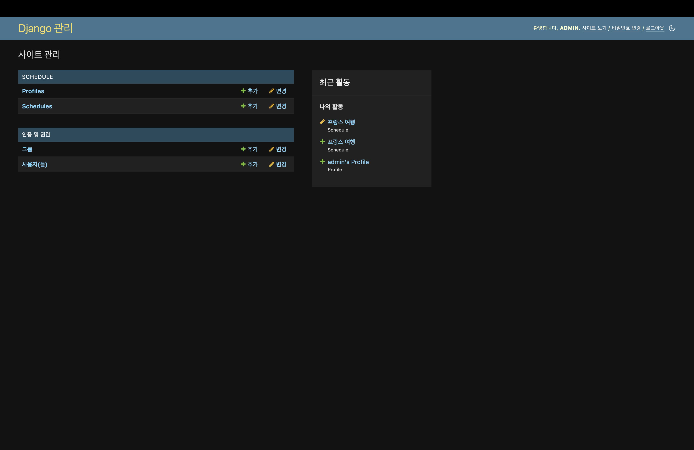
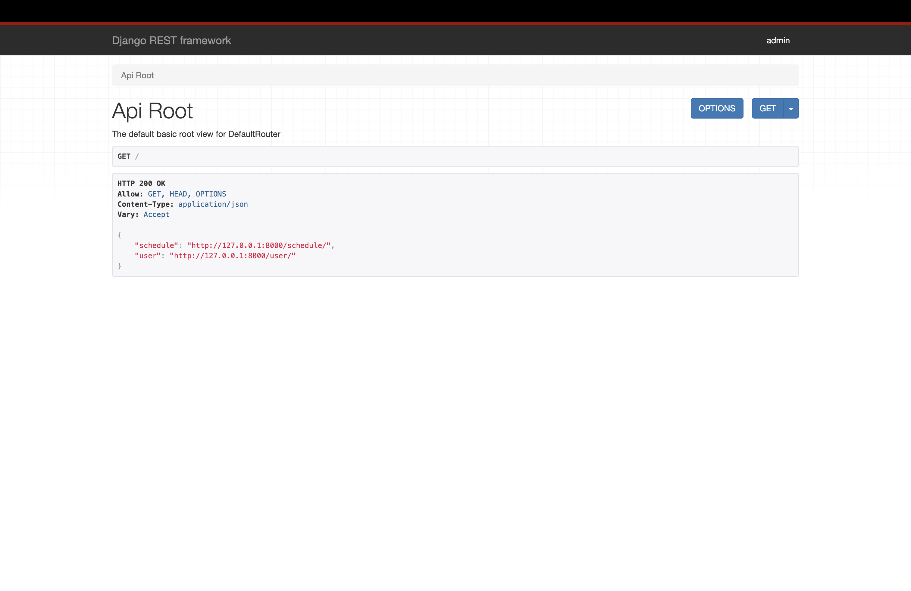
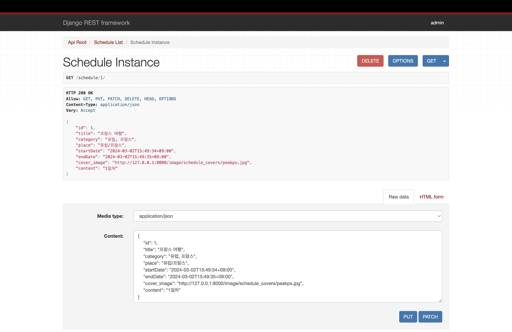

# 🛩️ 여행 스케줄 제작 웹 어플리케이션 - 백엔드

[📌 Model 설정](#-model-설정)<br>
<br>

## 📌 Model 설정

1. `python3 manage.py startapp schedule` : schedule 앱 생성
2. schedule/models.py 작성

```python
from django.db import models
from django.utils import timezone
from django.conf import settings
from django.contrib.auth.models import User

class Schedule(models.Model):
    title = models.CharField(max_length=128)
    category = models.CharField(max_length=100)
    place = models.CharField(max_length=128)
    startDate = models.DateTimeField()
    endDate = models.DateTimeField()
    cover_image = models.ImageField(upload_to='schedule_covers/', blank=True, null=True)
    content = models.TextField()

    def __str__(self):
        return self.title

class Profile(models.Model):
    user = models.OneToOneField(User,on_delete=models.CASCADE)
    image = models.ImageField(upload_to='profile_images/', blank=True, null=True)
    name = models.CharField(max_length=60, default='이름')
    email = models.EmailField()
    information = models.TextField()

    def __str__(self):
        return self.user.username + "'s Profile"
```

<br>

3. schedule/admin.py

```python
from django.contrib import admin
from .models import Schedule, Profile

admin.site.register(Schedule)
admin.site.register(Profile)
```

<br>

4. `python3 manage.py createsuperuser` : 슈퍼 유저 생성!



<br>

## 📌 React와 연동하기

🔗 [참고 : 티스토리 블로그](https://oliopasta.tistory.com/11)
🔗 [참고 : Django Rest Framework Docs](https://www.django-rest-framework.org/api-guide/routers/)

1. `pip install django-cors-headers`
2. settings.py

```py
MIDDLEWARE = [
    'corsheaders.middleware.CorsMiddleware',
    'django.middleware.common.CommonMiddleware',
    ...
]

# CORS
CORS_ORIGIN_WHITELIST = [
    'http://127.0.0.1:8000', 'http://localhost:3000']
CORS_ALLOW_CREDENTIALS = True
```

<br>

3. schedule/serializers.py

```py
from rest_framework import serializers
from .models import Schedule,Profile

class ScheduleSerializer(serializers.ModelSerializer):
    class Meta:
        model = Schedule
        fields = '__all__'


class ProfileSerializer(serializers.ModelSerializer):
    class Meta:
        model = Profile
        fields = '__all__'
```

<br>

4. schedule/views.py

```py
from django.shortcuts import render
from rest_framework import viewsets
from .models import Schedule,Profile
from .serializers import ScheduleSerializer, ProfileSerializer

class ScheduleViewSet(viewsets.ModelViewSet):
    queryset = Schedule.objects.all()
    serializer_class = ScheduleSerializer

class ProfileViewSet(viewsets.ModelViewSet):
    queryset = Profile.objects.all()
    serializer_class = ProfileSerializer
```

<br>

5. schedule/urls.py

```py
from django.urls import path, include
from rest_framework.routers import DefaultRouter
from .views import ScheduleViewSet, ProfileViewSet

router = DefaultRouter()
router.register(r'schedule', ScheduleViewSet)
router.register(r'user',ProfileViewSet)

urlpatterns = [
    path('', include(router.urls)),
]
```

<br>

6. urls.py

```py
from django.contrib import admin
from django.urls import path, include
from schedule import urls as schedule_urls

urlpatterns = [
    path('admin/', admin.site.urls),
    path('',include(schedule_urls))
]
```



